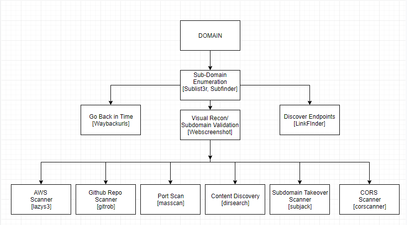

# ajrecon
ajrecon is a simple python script I use to automate my recon workflow

## Workflow


## Setting up Tools

### Sublist3r (Sub-Domain Discovery/Enumeration) 
Alternatives: [Subfinder](https://github.com/subfinder/subfinder) || [KnockyPy](https://github.com/guelfoweb/knock)

```bash
root@ajrecon:~# cd Tools
root@ajrecon:~# git clone https://github.com/aboul3la/Sublist3r.git
root@ajrecon:~# cd sublist3r
root@ajrecon:~# sudo apt-get install python-requests
root@ajrecon:~# sudo pip install -r requirements.txt
```

### Linkfinder (Find New Endpoints/JS Files)
```bash
root@ajrecon:~# cd Tools
root@ajrecon:~# git clone https://github.com/GerbenJavado/LinkFinder.git
root@ajrecon:~# cd LinkFinder
root@ajrecon:~# python setup.py install
```

### Waybackurl (Go Back in Time)
#### [1] [Install Go](https://flicsdb.com/how-to-install-golang-on-kali-linux/)

#### [2] ```root@ajrecon:~# go get github.com/tomnomnom/waybackurls```


### Webscreenshot (Screenshots)
Alternative: [EyeWitness](https://github.com/FortyNorthSecurity/EyeWitness) []()
```bash
root@ajrecon:~# apt-get update && apt-get install phantomjs
root@ajrecon:~# cd Tools
root@ajrecon:~# pip install webscreenshot
root@ajrecon:~# git clone https://github.com/maaaaz/webscreenshot.git
```

### Dirsearch (Content Discovery)
Alternatives: [GoBuster](https://github.com/OJ/gobuster) || [Wfuzz](https://github.com/xmendez/wfuzz)
```bash
root@ajrecon:~# cd Tools
root@ajrecon:~# git clone https://github.com/maurosoria/dirsearch.git
```


